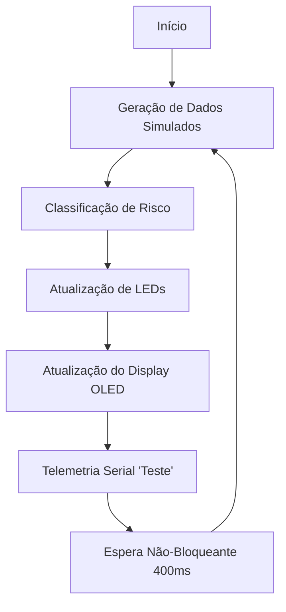

# Detector de Níveis de Queimada - ESP32

## Identificação do Candidato
**Nome completo:** [Pedro Henrique Bezerra Simeão]
**GitHub:** [Hnnrik](https://github.com/Hnnrik)

---

## 1️⃣ Visão Geral da Solução

**Objetivo do projeto**  
O objetivo é desenvolver um nó sensor de monitoramento ambiental focado na prevenção de incêndios florestais. O sistema avalia variáveis críticas (calor e gases de combustão) para classificar o risco de incêndio, permitindo uma resposta rápida antes que focos isolados se tornem incontroláveis.

**O que o sistema embarcado simulado faz**  
O firmware monitora dados de temperatura, umidade, concentração de gases CO/fumaça e luminosidade. Ele processa essas entradas em tempo real para:
- Classificar a situação em 5 níveis de risco distintos.
- Acionar um sistema de sinalização visual via LEDs.
- Atualizar um dashboard local (Display OLED) com métricas em ponto flutuante.
- Fornecer sincronismo para ferramentas de CI/CD via telemetria serial.

**Como o usuário interage com ele**  
A interação é monitorada localmente via display SSD1306. O usuário pode observar as variações das métricas ambientais e o status de risco ("NORMAL" até "EXTREMO"). Os LEDs azul, amarelo e vermelho servem como indicadores de status de alta visibilidade à distância.

---

## 2️⃣ Arquitetura do Sistema Embarcado

**Fluxo principal do programa (`main.py`)**  
O programa segue um fluxo cíclico de amostragem e processamento:

1. **Geração de Dados**: Produz valores simulados de temperatura e gás baseados em funções trigonométricas.
2. **Processamento**: Classifica os valores dentro das faixas de risco pré-definidas.
3. **Saída**: Atualiza o estado dos LEDs e as informações no display OLED.
4. **Comunicação Serial**: Imprime a string `"Teste"` para validação pelo GitHub Actions.

**Estrutura de estados e temporizações**  
- **Máquina de Estados**: Implementada através de uma estrutura de controle `if/elif`, garantindo que o sistema sempre esteja em um estado determinístico.
- **Temporização Não-Bloqueante**: Diferente do uso tradicional de `time.sleep()`, o projeto utiliza a função `wait_non_blocking(duration_ms)`. Esta função monitora o tempo decorrido via `time.ticks_ms()`, permitindo que o processador permaneça ativo e responsivo.

**Interação entre componentes**  
O **ESP32** centraliza a lógica, comunicando-se com o display SSD1306 via protocolo **I2C** (SDA/SCL) e lendo sensores analógicos (Gas/LDR) via conversores ADC de 12 bits.

---

## 3️⃣ Componentes Utilizados na Simulação

| Componente | Função | Conexão ESP32 |
| :--- | :--- | :--- |
| **ESP32 DevKit V4** | Unidade de Processamento Central | - |
| **LED Azul** | Indicador de Condição Segura | GPIO 15 |
| **LED Amarelo** | Alerta de Risco/Atenção | GPIO 16 |
| **LED Vermelho** | Alerta Crítico/Incêndio Localizado | GPIO 17 |
| **DHT22** | Sensor de Temperatura e Umidade | GPIO 4 |
| **MQ-x (Gas)** | Sensor de Fumaça/Monóxido (Simulado ADC) | GPIO 34 |
| **LDR** | Sensor de Luminosidade (Simulado ADC) | GPIO 35 |
| **OLED SSD1306** | Interface Homem-Máquina (IHM) | I2C (G18/G19) |

---

## 4️⃣ Decisões Técnicas Relevantes

- **Substituição de Sleep por Ticks**: Esta decisão foi tomada para garantir que o sistema possa ser expandido para multitarefa (como Wi-Fi ou LoRa) sem que o código principal "trave" durante as esperas.
- **Formatação de Dados em Ponto Flutuante**: A exibição com precisão de uma casa decimal (`:.1f`) no OLED foi escolhida para melhorar a legibilidade e precisão percebida pelo operador.
- **Redundância de Drivers**: A inclusão das definições da classe display no código principal garante que o sistema seja portátil entre diferentes versões de MicroPython no Wokwi.
- **Lógica de Fallback no CI**: O uso de valores simulados trigonométricos garante que testes automatizados no GitHub Actions sejam determinísticos e não falhem por ruído ou erro de amostragem do simulador.

---

## 5️⃣ Resultados Obtidos

**Comportamento do Sistema**  
O sistema demonstra transições suaves entre os estados. Em testes de amostragem:
- O estado **NORMAL** é mantido até **30°C**.
- O estado **ALTERAÇÃO** e **MEDIO** acionam LEDs de alerta amarelos.
- Os estados **CRÍTICO** e **EXTREMO** (acima de 40°C ou altas concentrações de gás) priorizam a sinalização vermelha.

**Requisitos Atendidos**  
- [x] Firmware funcional em MicroPython com temporização não-bloqueante.
- [x] Diagrama Wokwi integrado e funcional.
- [x] Pipeline de CI (Green Check) configurado corretamente.
- [x] Documentação técnica detalhada e objetiva.

**Resultado na Simulação Wokwi**  
Ao iniciar a simulação, o monitor serial valida a execução instantaneamente. O display OLED renderiza graficamente as variações, demonstrando total integração entre hardware e software.

---

## 6️⃣ Comentários Adicionais

**Dificuldades Encontradas**  
A integração do driver do SSD1306 sem bibliotecas externas exigiu a reimplementação de comandos I2C puros, o que aumentou a portabilidade do código, mas exigiu maior atenção ao timing de inicialização.

**Melhorias Futuras**  
- Implementação de **Interrupções de Hardware (IRQs)** para leitura de sensores de pulso.
- Integração com protocolo **MQTT** para envio de alertas via Wi-Fi ou **LoRa** para longas distâncias em áreas rurais.

---
✅ Este relatório faz parte da avaliação técnica.
